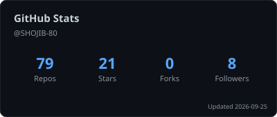
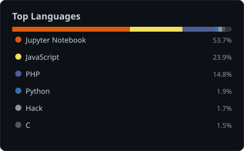

 

&nbsp;

&nbsp;

&nbsp;

---

## About me

I'm a Full Stack Web Developer from Bangladesh. I work across the entire stack — database schema to backend logic to the interface users actually touch. I studied CSE at East West University and have been shipping real applications ever since: management systems with proper role-based access, animated frontends built from scratch, and database-backed tools that solve real problems.

I'm open to **remote work and freelance projects**. If you need someone who can take a spec and deliver a working product, let's talk.

- 🔭 Currently building a full-stack project with JWT auth and a REST API
- 🌱 Deepening **Next.js** and **TypeScript** in production contexts
- 🌐 Available for remote contracts and freelance — short or long term
- 📍 Based in Bangladesh · UTC +6

---

## Tech stack

  

---

## Featured projects

<table>
<tr>
<td width="50%" valign="top">

**🎓 Student Management System**

`PHP` `MySQL` `HTML` `CSS`

University admin panel with full CRUD for students, teachers, and courses. Handles session-based auth, relational data across multiple tables, and role separation between admin and staff.

</td>
<td width="50%" valign="top">

**✨ LUCID — Interactive UI**

`JavaScript` `CSS` `HTML`

Frontend showcase with particle systems, water ripple click effects, scroll-triggered counters, and an auto-hiding navbar. No frameworks — pure JS doing real work.

&nbsp;

</td>
</tr>
<tr>
<td width="50%" valign="top">

**🏫 School Management System**

`Java` `OOP`

Desktop application managing school operations — student records, teacher assignments, and course data. Built around clean object-oriented design principles learned from the ground up.

</td>
<td width="50%" valign="top">

**🖱️ CSS Button Effects**

`HTML` `CSS`

20+ hover animations handcrafted in pure CSS — transitions, gradient sweeps, border draws, 3D transforms. Zero JS. Copy-paste ready for any web project.

&nbsp;

</td>
</tr>
</table>

  <a href="https://github.com/SHOJIB-80/STUDENT-MANAGEMENT-SYSTEM-DATABASE-">Student Management System</a> ·
  <a href="https://shojib-80.github.io/_LUCID/">LUCID (live)</a> ·
  <a href="https://github.com/SHOJIB-80/School-Management-System-">School Management System</a> ·
  <a href="https://shojib-80.github.io/buttons_hover_effects/">Button Effects (live)</a>

---

## GitHub stats

<picture>
  <source media="(prefers-color-scheme: dark)"  srcset="assets/stats-dark.svg">
  <source media="(prefers-color-scheme: light)" srcset="assets/stats-light.svg">
  
</picture>
&nbsp;
<picture>
  <source media="(prefers-color-scheme: dark)"  srcset="assets/langs-dark.svg">
  <source media="(prefers-color-scheme: light)" srcset="assets/langs-light.svg">
  
</picture>

<picture>
  <source media="(prefers-color-scheme: dark)"  srcset="https://raw.githubusercontent.com/SHOJIB-80/SHOJIB-80/output/snake-dark.svg">
  <source media="(prefers-color-scheme: light)" srcset="https://raw.githubusercontent.com/SHOJIB-80/SHOJIB-80/output/snake-light.svg">
  
</picture>

---

## Contribution graph

  
  &nbsp;
  

---

## Currently

Right now I'm focused on building things that work at a professional level — not just feature-complete but maintainable, structured, and deployable. Next.js with TypeScript for the frontend, proper API design on the backend.

If you're a recruiter or client looking at this profile: I don't have ten years of experience. What I do have is a clear understanding of how the full stack fits together and a track record of finishing what I start. That's worth something.

---

## Let's work together

I respond fast. If you have a project in mind, reach out directly.

📧 **shojib456123@gmail.com**  
💼 [linkedin.com/in/md-sirajul-islam-shojib](https://www.linkedin.com/in/md-sirajul-islam-shojib/)  
🌐 [mdsirajulislamshojib.com](https://mdsirajulislamshojib.com)
